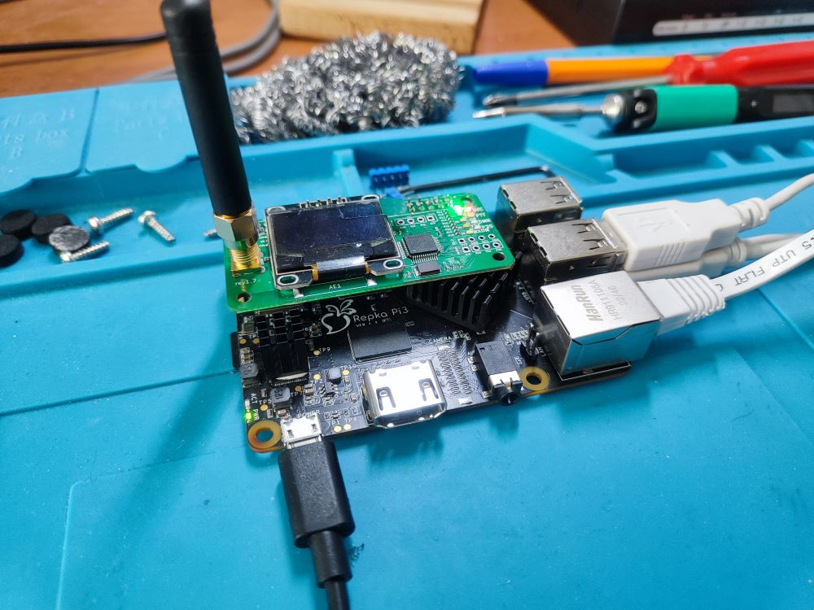

# Что в этом репозитории
Здесь зафиксирован путь боли и преодолений по запуску DMR Хотспота на базе [MMDVMHost](https://github.com/g4klx/MMDVMHost) и [DMRGateway](https://github.com/g4klx/DMRGateway) на российском аналоге RaspberryPi - [RepkaPi](https://repka-pi.ru/)

Возможно позже появится автоматизация.

Пока просто заметки. 



# Железки
- MMDVM_HS_HAT c [Aliexpress](https://aliexpress.ru/item/32915442246.html?spm=a2g2w.orderdetail.0.0.48e84aa6vTCf5Q&sku_id=12000024784954883)
- [Repka Pi 3](https://repka-pi.ru/) v. 1.3 2Gb

# Инструкция
## Конфигурируем Репку
Предполагаем что вы накатили на Репку [родную операционную систему](https://repka-pi.ru/#operation-system-anchor), она запустилась и вы получили доступ в терминал.
### Распиновка GPIO
По у молчанию у Репки отличается и выглядит [так](https://repka-pi.ru/#periphery_block) но с помощью поставляемой вместе с ОС утилиты `repka-config` её необходимо поменять. Нам нужен вариант 2.

### UART

> [!CAUTION]
> По у молчанию у Репки включен вывод на UART что неизбежно приведет к проблемам в работе модема (шляпы) его необходимо отключить

В версии `v1.0.18_d16.02.24` пункт конфигуратора называется `1 console-UART0-on/off` 

## Прошиваем модем
Возможно модем с Алиэкспресса уже приходит прошитым - я не знал как это проверить и поэтому занялся прошивкой. Но проверить это можно. Статья в [этом блоге](https://www.mmdvm.club/index.php/archives/249/) говорит что **прошитый модем мигает красным светодиодом с интервалом в 1 секунду**. Что похоже на правду. Или наверняка - прочитать прошивку и посмотреть что внутри.

Для того чтобы прошить модем или прочитать его прошивку нужно перевести его в режим прошивки по UART. Для этого необходимо в определенной последовательности переключить состояние определённых GPIO пинов (20 и 21). `stm32flash` поидее может сделать это и сама но файлы за которые надо дергать GPIO у репки расположены в других местах так что выхода 2 - хачить исходники `stm32flash` либо перемапить пины с помощью библиотеки и шить 2 команды. Я выбрал последнее.
#### Устанавливаем stm32flash
Эта штука просто есть в репозитории - качаем
```bash
sudo apt install stm32flash
```
#### Устанавливаем библиотеку для работы с GPIO
Для совместимости с Raspberry Pi Репке нужно переключать пины программным способом. Ставим зависимости
```bash
sudo apt update
sudo apt install python3-dev python3-setuptools git
```
Качаем [бибилиотеку](https://gitflic.ru/project/repka_pi/repkapigpiofs)
```bash
git clone https://gitflic.ru/project/repka_pi/repkapigpiofs.git
```
Устанавливаем
```bash
cd repkapigpiofs
sudo python3 setup.py install
```
Далее либо пишем сами либо запускаем [скрипт](repka-hat.py) из этого репозитория
```bash
root@Repka-Pi:~/sources/repka-star# python3 repka-hat.py enter
Repka Pi 3
enter bootloader mode
```
Это переведет модем в режим прошивки и тогда можно будет посмотреть данные о нём
```bash
root@Repka-Pi:~/sources/repka-star# stm32flash /dev/ttyS0
stm32flash 0.5

http://stm32flash.sourceforge.net/

Interface serial_posix: 57600 8E1
Version      : 0x10
Option 1     : 0x00
Option 2     : 0x00
Device ID    : 0x0410 (STM32F10xxx Medium-density)
- RAM        : 20KiB  (512b reserved by bootloader)
- Flash      : 128KiB (size first sector: 4x1024)
- Option RAM : 16b
- System RAM : 2KiB
```
Читаем прошивку в файл
```bash
root@Repka-Pi:~/sources/repka-star# stm32flash -r dump.bin /dev/ttyS0
stm32flash 0.5

http://stm32flash.sourceforge.net/

Interface serial_posix: 57600 8E1
Version      : 0x10
Option 1     : 0x00
Option 2     : 0x00
Device ID    : 0x0410 (STM32F10xxx Medium-density)
- RAM        : 20KiB  (512b reserved by bootloader)
- Flash      : 128KiB (size first sector: 4x1024)
- Option RAM : 16b
- System RAM : 2KiB
Memory read
Read address 0x08020000 (100.00%) Done.
```
Смотрим есть ли в ней чтонибудь про MMDVM
```bash
root@Repka-Pi:~/sources/repka-star# strings dump.bin | grep -i mmdvm
MMDVM_HS FW configuration:
MMDVM_HS_Hat-v1.5.2 20201108 14.7456MHz ADF7021 FW by CA6JAU GitID #89daa20
```
Если да - то шить ничего не надо, если нет то надо шить. Можно сделать с тем же скриптом с командой `flash`
```bash
 python3 repka-hat.py flash
```
Он делает следующее
1. Качает прошивку из https://github.com/juribeparada/MMDVM_HS/
2. Перетыкает GPIO пины так же как и `enter` чтобы попасть в режим прошивки
3. Запускает `stm32flash` заливает скачанную прошивку
4. Перетыкает GPIO пины для выхода из режима прошивки и перезапускает модем ``
## Собираем софт
Клонируем репозитории [MMDVMHost](https://github.com/g4klx/MMDVMHost) и [DMRGateway](https://github.com/g4klx/DMRGateway) и собираем - у обоих в описании есть инструкция, но по сути оно водится к запуску `make` и оно всё собирается. Получаем на выходе 2 бинаря.
## Конфигурируем софт
В этом репозитории лежит два конфига 

- [mmdvmhost.cfg](mmdvmhost.cfg)
- [dmrgateway.cfg](dmrgateway.cfg)

Из этих конфигов выкинуто все лишнее (на мой взгляд ну и то что точно не работает) Их можно открыть и подрихтовать под себя. Поменять частоту работы, описание хотспота, позывной и прочее.

## Запускаем
Никакого [pistar](https://www.pistar.uk/) на Repka Pi не предвидется как минимум потому что исходников в открытом доступе нет, так что будем запускать руками.

Я сделал `systemd` файлы [mmdvm.service](mmdvm.service) и [dmrgateway.service](dmrgateway.service) чтобы их использовать:

- внутри можно поменять пути для `pid` файлов и расположения бинарей туда где всё лежит на вашей системе
- скопировать файлы `*.service` в `/etc/systemd/system`
- инициализировать
    ```bash
    systemctl enable mmdvmhost
    systemctl enable dmrgateway
    ```
- перезагрузиться
- сервисы должны запуститься самостоятельно проверить это можно с помощью команды `status`
    ```bash
        > systemctl status mmdvmhost

        ● mmdvmhost.service - MMDVMHost
        Loaded: loaded (/etc/systemd/system/mmdvmhost.service; enabled; vendor preset: enabled)
        Active: active (running) since Sat 2024-03-09 20:47:25 MSK; 18min ago
        Main PID: 390 (MMDVMHost)
        Tasks: 2 (limit: 2230)
        Memory: 3.2M
        CGroup: /system.slice/mmdvmhost.service
                └─390 /etc/mmdvmhost /etc/mmdvmhost.cfg
        
        ...

        > systemctl status dmrgateway

        ● dmrgateway.service - DMRGateway
        Loaded: loaded (/etc/systemd/system/dmrgateway.service; enabled; vendor preset: enabled)
        Active: active (running) since Sat 2024-03-09 20:47:25 MSK; 19min ago
        Main PID: 388 (DMRGateway)
        Tasks: 1 (limit: 2230)
        Memory: 1.5M
        CGroup: /system.slice/dmrgateway.service
                └─388 /etc/dmrgateway /etc/dmrgateway.cfg

    ```

# Выводы

1. Сделать хотспот на Repka Pi можно - **всё работает**
2. Установку и запуск автоматизировать несложно - начал [тут](setup.sh)
3. Компилировать программы [MMDVMHost](https://github.com/g4klx/MMDVMHost) и [DMRGateway](https://github.com/g4klx/DMRGateway) самостоятельно необязательно можно собрать и распространять уже готовые бинари
4. Единственная проблема - конфигурирование на лету через Web-интерфейс который предоставляет pistar - портировать его невозможно так как нет доступа к исходникам - остается только писать свой
